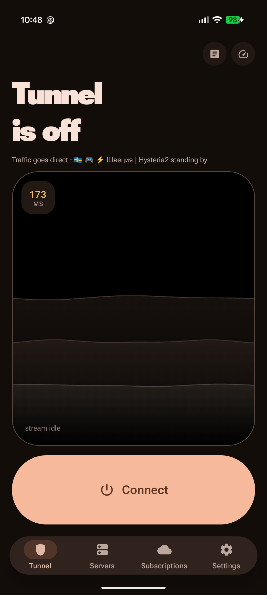
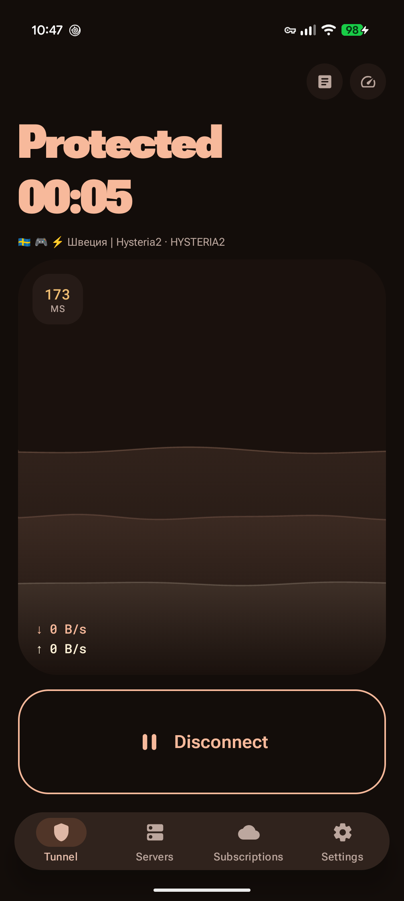
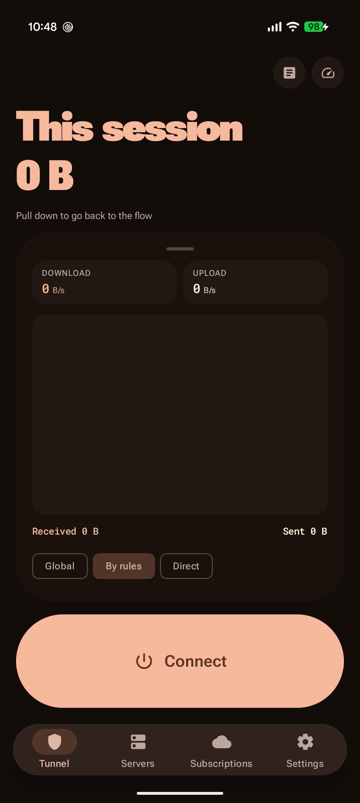
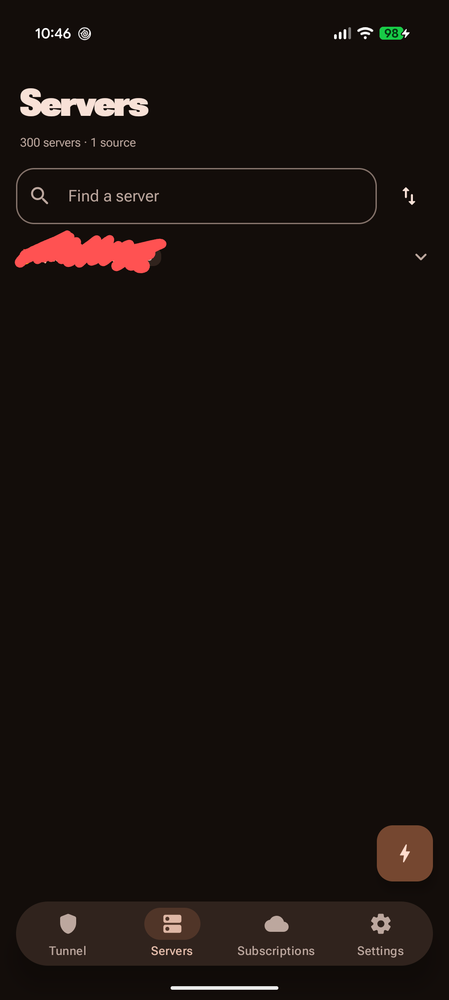
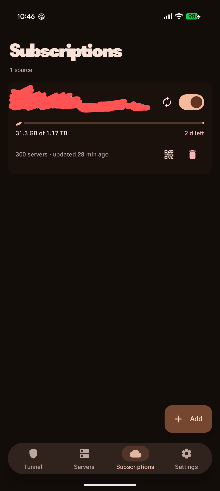
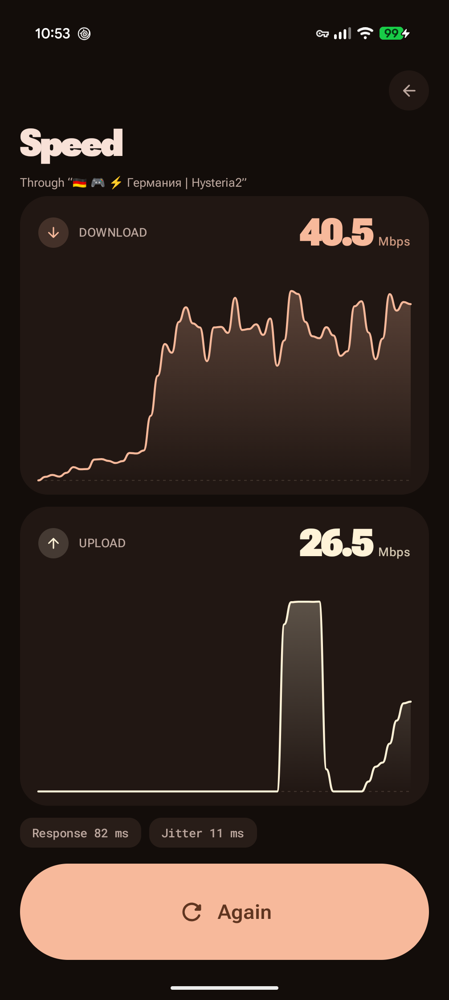

# Yumi

*Read this in [Russian](README.md).*

A VPN client for Android: subscriptions, servers from a link or a QR code, DNS resolvers, a tunnel
on the [Xray](https://github.com/XTLS/Xray-core) core and a Material 3 Expressive interface.

**[Download the latest release](https://github.com/GXUser7/yumi/releases/latest)** ·
[Telegram channel](https://t.me/MaterialYouCloud)

Almost everybody wants the **arm64-v8a** file. The `armeabi-v7a` build is only for very old
phones; if you are not sure which one you have, take arm64. Android 8.0 or newer is required.

| | | |
|:-:|:-:|:-:|
|  |  |  |
|  |  |  |

## What it can do

**You can add almost anything.** `vless://`, `vmess://`, `trojan://`, `ss://`, `hysteria2://`,
`wireguard://`, `socks://` and `http://` links — by pasting or by QR code; everything except
`http://` is also caught when you tap such a link in another app. Subscriptions are read in any of
the formats panels hand them out in: a list of links (base64 or plain text), **Clash YAML**,
**Xray/v2ray JSON** and **SIP008**. When adding something you can say outright what you are
pasting — a subscription, a server or a DNS resolver — or leave the detection to the app.

**Transports:** TCP/RAW, WebSocket, gRPC, HTTPUpgrade, **XHTTP** (also known as splithttp), mKCP
and QUIC — with TLS, REALITY, Vision and browser-fingerprint mimicry (uTLS). XHTTP arrived in 2.0
along with the change of core: panels hand out such nodes more and more often, and the previous
core could not speak it — the server sat in the list, showed a healthy ping, brought the tunnel up,
and carried not one connection.

What the core **cannot** do: TUIC, AnyTLS, ShadowTLS, Hysteria v1, SSH, and subscriptions in the
sing-box JSON format. Such nodes are filtered out when they are added and written to the journal,
rather than sitting in the list quietly not working.

**DNS resolvers** are objects just like servers: added by a link (a DoH address, `tcp://`,
`udp://`, a bare address or an `sdns://` stamp), stored as a list and switched with a single tap,
including on a live tunnel. DNS-over-TLS and DNS-over-QUIC are not implemented in this core, so
`tls://` and `quic://` are refused when added rather than quietly downgraded to plain UDP: handing
your ISP the list of names you look up is the one thing an encrypted resolver was chosen to
prevent.

The "Direct" mode together with a chosen resolver gives you "no VPN, but the DNS I want" — traffic
leaves from your ordinary address while names are resolved by the service you picked.

**Latency and speed.** Latency is measured three ways: a TCP handshake, a full TLS handshake (for
REALITY that is the difference between "the port is open" and "the disguise works") and the median
of three probes; QUIC nodes are checked with a UDP probe. The speed test runs **through the
selected server** rather than past the tunnel, and reports download, upload, response time and
jitter with a dial gauge and a live chart.

**Routing.** Three modes: everything through the tunnel, everything direct, or by rules — Russian
sites and addresses go around the VPN. The routing databases (`geoip.dat` and `geosite.dat`, some
24 MB together) are fetched on their own after the first connection; settings carry a section
showing whether they are on disk, and a button to refresh them. Until they are there the rules that
name them are simply left out of the configuration — worth showing, because from the outside such a
tunnel looks perfectly healthy. Separately: local network bypass, ad-domain blocking and per-app
split tunnelling.

**Changing servers on a live tunnel** does not break the connection: the servers live in the
configuration as a group, and moving between them is a pointer swap inside the core. The tunnel,
the DNS cache and every open connection stay where they are, and the traffic counters and session
timer pass through the switch without resetting.

**Leaving a server that stopped working.** While the tunnel is up the app asks it for a page every
twenty seconds — not a ping at the port from outside, but data pulled through, because a server can
answer on its port while carrying nothing at all. Two failures in a row, the second three seconds
after the first, and the tunnel moves to a server that works. Which servers those may be is yours
to say: the replacement list is chosen by hand rather than filled with the whole subscription.

It also tries not to blame a server for somebody else's fault. A phone with no internet — a lift, a
tube station — is not a dead server, and the checks simply pause. A change of network closes the
connections pinned to the old one at once instead of leaving them to time out. And when nothing
answers at all, the app stays put: that means the fault is not the server's.

**Your own servers for mobile data.** A second list. While it is empty every network shares one
list; fill it, and moving to a cellular network moves the tunnel onto one of these and keeps it
there — a replacement for a failure comes from the same list — while returning to Wi-Fi chooses
from the ordinary replacement list.

What counts is the cellular network itself, not a metered one: "metered" describes a billing
arrangement rather than a network, so a temporarily unmetered 5G plan and a home Wi-Fi marked as
limited both stay out of it. The move waits for the network to settle — four seconds onto cellular,
twelve on the way back — because at the edge of coverage a phone flickers between networks for as
long as somebody stands there. With the screen off the move is deferred: some firmwares switch
Wi-Fi off along with the screen and fall back to cellular.

**A fallback resolver.** A dead resolver is the one failure changing servers cannot fix, and the
least visible: every site stops opening while the tunnel demonstrably carries traffic. The health
check has a second half that resolves a name through your own DNS; two failures in a row and the
app moves to `1.1.1.1` until the next reconnection, and says so.

**Updates from inside the app.** There is no store, so nothing updates the app but the app: a check
every twelve hours or on a button, a download, and a handover to the system installer.

**Notices about what it repaired by itself.** The whole value of moving off a failed server is that
nobody is watching when it happens — which is exactly why nobody learns that it did. Four separate
switches: a replaced server, a replaced resolver, a hand-picked list emptied by a subscription
refresh, a new version.

**And also.** English and Russian — the system language by default, or pick one explicitly in
settings. A quick settings tile (with an add button, if your shell does not offer one), auto-start
on boot, support for "Always-on VPN", the core's journal right inside the app, a dark theme with
an AMOLED mode and a palette taken from the system wallpaper.

## Privacy

The app collects no statistics and sends no data about you anywhere. Servers, subscriptions and
keys live only on the phone: Android backup is turned off for them, so they reach neither Google's
cloud nor a new handset during a device-to-device transfer.

The connections it makes on its own: refreshing your subscriptions, measuring latency to your
servers and — if you start it — measuring speed through `speed.cloudflare.com`. All of them go
around the tunnel: otherwise the measurement would be measuring itself, and a subscription refresh
would travel through the very server it hands out.

One exception, and it is needed where the internet is handed out by allow-list: when a subscription
will not open directly, the app repeats the request through its own tunnel. Without that it cannot
be refreshed on such a network at all — the app excludes itself from the tunnel it serves, so its
requests hit the same block as everything else.

Panels that bind to a device receive an `x-hwid` identifier. It is **random and generated once at
install time**: a real device identifier would become a marker by which every panel the user has
ever subscribed to could recognise them.

## Installation

1. Download `yumi-<version>-arm64-v8a.apk` from the [releases](https://github.com/GXUser7/yumi/releases/latest).
2. Open the file and allow installation from this source if Android asks.
3. On the first connection the system will ask for VPN permission — the tunnel cannot come up
   without it.

Updates install over the top; servers and settings are kept.

## Building from source

```bash
export JAVA_HOME=~/.gradle/jdks/eclipse_adoptium-21-amd64-linux.2
./gradlew :app:assembleDebug          # phone
./gradlew :tv:assembleDebug           # television
./gradlew :shared:testDebugUnitTest   # the tests live here; :app and :tv hold none
```

**The core is not in the repository.** Xray publishes no mobile binding, so this one lives here:
the `core-xray/` module, out of which `gomobile bind` produces `shared/libs/libyumi.aar`. That file is
over GitHub's 100 MB per-file limit, so you have to build it yourself and drop it in by hand —
nothing compiles without it, tests included. The build command, and everything else worth knowing
about the internals, is in [DEVELOPMENT.md](DEVELOPMENT.md): why the TUN stack is gvisor, how core
failures are caught, where the geo rules come from, and how all of it is checked without a device.

## Acknowledgements

The core is [Xray-core](https://github.com/XTLS/Xray-core) by XTLS. The routing databases come
from [v2fly/geoip](https://github.com/v2fly/geoip) and
[v2fly/domain-list-community](https://github.com/v2fly/domain-list-community).

## License

[GNU GPL v3 or later](LICENSE). Copyright © 2026 GXUser7.

Still not a free choice, though the reason changed along with the core. Xray-core itself is
MPL-2.0, and that alone would have allowed any licence at all. But Xray's Shadowsocks-2022
implementation is built on [`sagernet/sing`](https://github.com/SagerNet/sing), which is GPLv3 or
later, and `libyumi.aar` links it straight into the app along with everything else. So the app as a
whole has to be GPLv3 as well.

In practice that means anyone handing out a built APK owes the source alongside it, under the same
licence.
